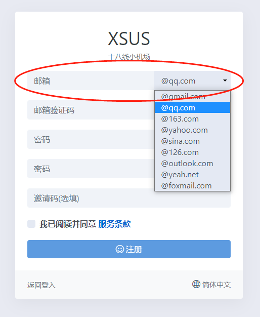
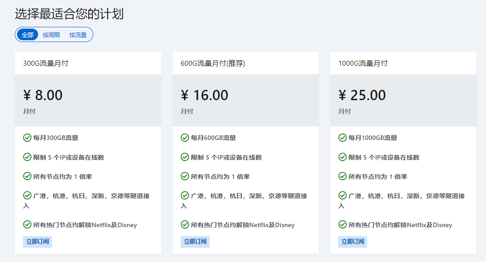
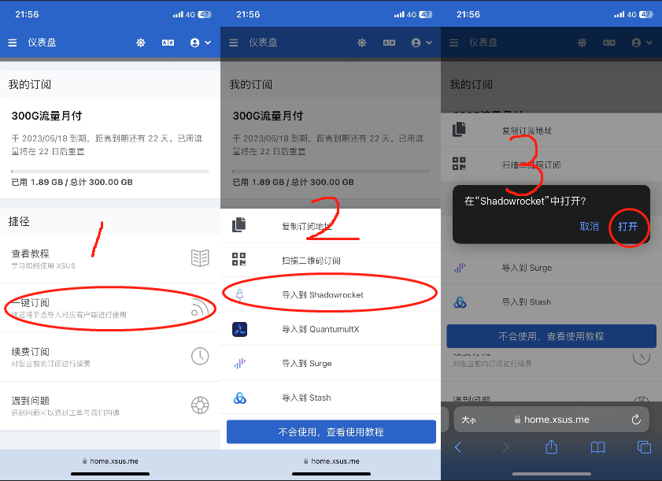
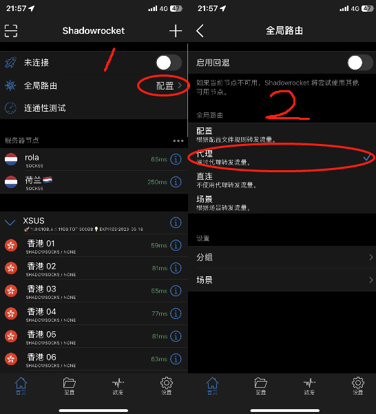
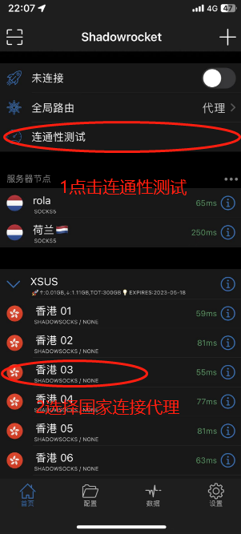
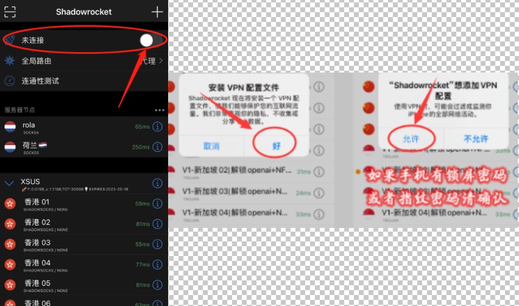

# 第二步、开启小火箭使用推特

------

 请自备科学上网节点，如果没有推荐购买XSUS加速高速节点

可以解决推特注册限制等等的问题，官网有在线客服在线排忧解难

## [🏆速度飞快不卡顿节点[点击购买]🏆](https://home.xsus.me/index.php/#/register?code=DgUNf61j)

### https://home.xsus.me/index.php/#/register?code=DgUNf61j

> 节点网站是我们从网上搜集的速度快稳定的，只做推荐使用，有任何节点问题请直接联系网站客服。
> 我们会持续为大家搜集，速度更快更稳定的节点。
> 再次提醒：禁止使用节点进行任何违反法律的操作，因此操作产生的法律纠纷本店概不负责！

## 一、购买节点

1、复制下面这个网址到浏览器中打开

 https://home.xsus.me/index.php/#/register?code=DgUNf61j

 2、注册登录

3、点击购买订阅-选择合适的套餐付款

 4、如何导入节点

###  一键导入到小火箭

点击左上角三个横杠 - 进入仪表盘 - 点击一键订阅 - 选择导入到Shashadowrocket

### 注意：一定要使用苹果自带浏览器打开加速器官网，不要用微信或者其它浏览器打开 否则导入会没有反应。

 5、将全局路由 配置 修改成 代理

6、点击连通性测试，有问题的节点会显示超时，出现绿色数字表示节点正常

7、打开小火箭的连接开关按钮，点允许，注意这一步一定要点允许

# 二、打开推特注册账号

注册不了可以直接购买特推号；特推号购买地址：http://uuohh8.fk55.cn/

### 1、用国内手机号码注册账号，打开推特–输入个人资料（年龄需要满18周岁）点击注册—-输入收验证码注册

### 2.创建密码，创建用户名，然后点下一步

### 3.通知打开或关闭都可以，随便选择几个兴趣内容，然后点击下一步

### 推特各项功能自行研究

### 本篇教程要点

1.必须要打开小火箭连接才能使用推特
2.无法注册账号大概率节点问题
3.推荐购买XSUS订阅套餐（轻松解决注册问题）

## [🏆速度飞快不卡顿节点[点击购买]🏆](https://home.xsus.me/index.php/#/register?code=DgUNf61j)

### https://home.xsus.me/index.php/#/register?code=DgUNf61j

